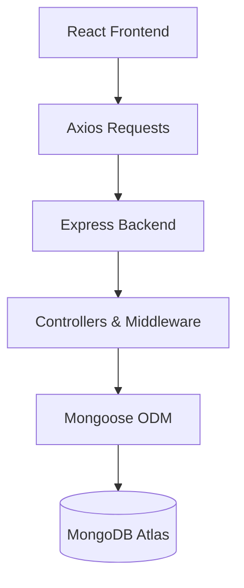

# 💡 ThinkTogether

> **ThinkTogether** is a full-stack MERN application that enables users to share innovative ideas, discover projects from others, and collaborate with like-minded people. The platform includes secure authentication, user profiles, idea management, and Google OAuth integration.

---

# 🚀 Project Overview

ThinkTogether is a collaborative platform where users can:

- 🔐 Register and Login securely
- 🌐 Login using Google OAuth
- 💡 Create innovative ideas
- 🌍 Explore ideas shared by other users
- 👤 View user profiles
- 📝 Edit personal profile
- 📂 View their own ideas
- 🗑️ Edit/Delete their own ideas
- 🔒 Secure routes using session authentication

The project follows the **MERN Stack** architecture with React on the frontend and Express + MongoDB on the backend.

---

# ✨ Features

## Authentication

- Email & Password Login
- Google OAuth Login
- Session-based Authentication
- Secure Logout

## User

- Register Account
- Login
- View Profile
- Edit Profile
- Google Login Support

## Ideas

- Create Idea
- View All Ideas
- View Individual Idea
- Update Idea
- Delete Idea
- View My Ideas

## Security

- Authentication Middleware
- Authorization (Only owner can edit/delete)
- Environment Variables
- Session Management

---

# 🛠 Tech Stack

## Frontend

- React.js
- Vite
- React Router DOM
- Axios
- Bootstrap 5

## Backend

- Node.js
- Express.js
- MongoDB Atlas
- Mongoose
- Passport.js
- Passport Local
- Passport Google OAuth
- Express Session
- Connect Mongo

---

# 🏗 Project Architecture



---

# 📂 Folder Structure

```text
ThinkTogether
│
├── Frontend
│   ├── src
│   ├── public
│   ├── package.json
│   └── README.md
│
├── Backend
│   ├── config
│   ├── controllers
│   ├── middleware
│   ├── models
│   ├── routes
│   ├── utils
│   ├── app.js
│   ├── package.json
│   └── README.md
│
├── README.md
└── .gitignore
```

---

# 📸 Screenshots

Add screenshots here after deployment.

Example:

- Home Page
- Login Page
- Signup Page
- Explore Ideas
- Create Idea
- Profile Page
- My Ideas

---

# ⚙️ Installation

## Clone Repository

```bash
git clone https://github.com/YOUR_USERNAME/ThinkTogether.git
```

## Backend

```bash
cd Backend
npm install
npm start
```

## Frontend

```bash
cd Frontend
npm install
npm run dev
```

---

# 🔑 Environment Variables

Create a `.env` file inside the Backend folder.

```env
MONGO_URI=

SESSION_SECRET=

GOOGLE_CLIENT_ID=

GOOGLE_CLIENT_SECRET=

PORT=
```

---

# 🌐 API Overview

## User APIs

| Method | Endpoint | Description |
|---------|----------|-------------|
| POST | `/user/signup` | Register User |
| POST | `/user/login` | Login |
| POST | `/user/logout` | Logout |
| GET | `/user/profile` | Get Profile |
| PUT | `/user/profile` | Update Profile |

---

## Google Authentication

| Method | Endpoint |
|---------|----------|
| GET | `/auth/google` |
| GET | `/auth/google/callback` |

---

## Idea APIs

| Method | Endpoint | Description |
|---------|----------|-------------|
| GET | `/ideas` | Get All Ideas |
| GET | `/ideas/:id` | Get Single Idea |
| POST | `/ideas` | Create Idea |
| PUT | `/ideas/:id` | Update Idea |
| DELETE | `/ideas/:id` | Delete Idea |
| GET | `/ideas/my` | Get User Ideas |

---

# 🔐 Authentication Flow

## Local Authentication

```text
Register
      │
Hash Password
      │
Store User
      │
Login
      │
Passport Local
      │
Session Created
      │
Cookie Stored
      │
Authenticated User
```

---

## Google OAuth

```text
Continue with Google
        │
Google Login
        │
Google Callback
        │
Find/Create User
        │
Session Created
        │
Redirect Frontend
```

---

# 🗄 Database Schema

## User

```text
name
username
email
password
googleId
bio
github
linkedin
portfolio
profileImage
```

---

## Idea

```text
title
description
tags
owner
createdAt
updatedAt
```

Relationship

```text
One User
      │
      ▼
Many Ideas
```

---

# 🔄 Project Workflow

```text
User

↓

React UI

↓

Axios Request

↓

Express Route

↓

Middleware

↓

Controller

↓

MongoDB

↓

JSON Response

↓

React UI Updated
```

---

# 📦 Major Packages Used

### Frontend

- React
- React Router DOM
- Axios
- Bootstrap
- Vite

### Backend

- Express
- Mongoose
- Passport
- Passport Local
- Passport Google OAuth
- Express Session
- Connect Mongo
- dotenv
- CORS

---

# 🚀 Future Improvements

- Profile Picture Upload
- Comments
- Likes
- Bookmarks
- Search & Filters
- Notifications
- Email Verification
- Password Reset
- Admin Dashboard
- Deployment on Render & Vercel

---

# 📚 Learning Outcomes

Through this project, I gained hands-on experience with:

- Building a complete MERN Stack application
- Designing RESTful APIs
- Implementing Local & Google OAuth Authentication
- Session & Cookie Management
- MongoDB Relationships using Mongoose
- CRUD Operations
- React Hooks
- React Router
- Axios Integration
- MVC Architecture
- Environment Variable Management
- Full-stack application development

---

# 📁 Documentation

Additional documentation is available inside:

- **Backend/README.md** → Backend architecture, APIs, authentication, database, middleware, interview notes.
- **Frontend/README.md** → React architecture, routing, components, hooks, state management, interview notes.

---

# 👨‍💻 Author

**Sagar Raj**

### Tech Stack

**MERN Stack**

- MongoDB
- Express.js
- React.js
- Node.js

---

## ⭐ If you like this project, consider giving it a star on GitHub!
